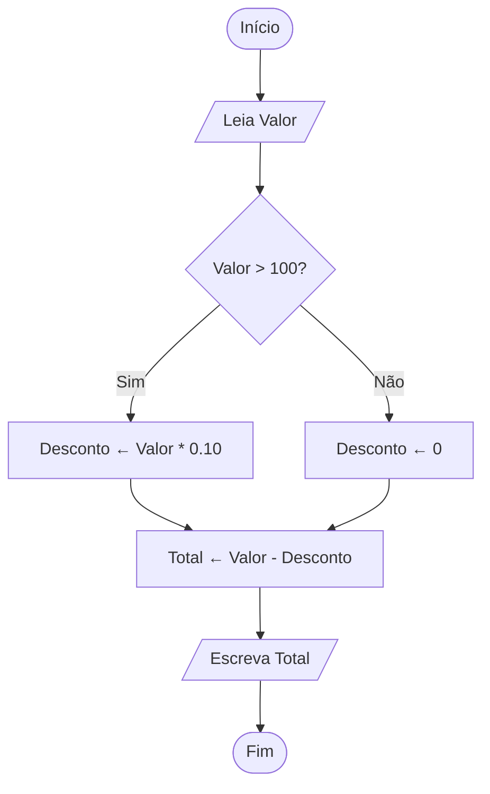

EXERCÍCIO 3 - FLUXOGRAMA
“Uma loja dá desconto de 10% para compras acima de R$ 100. Leia o valor da compra e
mostre o valor final a pagar.”

```mermaid
flowchart TD 
    A([Início]) --> B[/Leia Valor/]
    B --> C{Valor > 100?}
    C -->|Sim| D[Desconto ← Valor * 0.10]
    C -->|Não| E[Desconto ← 0]
    D --> F[Total ← Valor - Desconto]
    E --> F
    F --> G[/Escreva Total/]
    G --> H([Fim])
```
